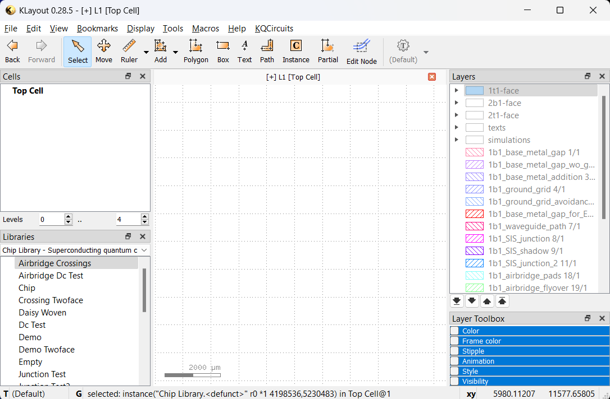

First look around
=================

Once KQCircuits is installed, KLayout will look like this:

* In the **Libraries** panel, you can choose the KQCircuits libraries with Chips, Elements, Qubits, Junctions and Test
  structures. You can drag these elements from the library to the drawing area to place them. After placing an element,
  press ``*`` and **F2** to make sure everything is visible.
* In the **Layers** panel, the KQCircuits layers are defined. They are grouped by face, most things are drawn in the
  **1t1-face** by default.

Introduction to Elements
------------------------

KQCircuits provides a collection of ``Elements``, which are building blocks for creating complex designs. The elements
are grouped into several **Libraries**, including the following:

- The ``Element Library`` contains basic elements such as waveguides, capacitors and connectors
- The ``Qubit Library`` contains qubit shapes
- The ``Chip Library`` contains example chip designs, which are also elements

Internally, elements are built on the KLayout concept of PCells, short for *parametric cells*. Each element has a set of
parameters, which can be changed to modify the shape or other features.

An important concept in KLayout is the distinction between cells and instances. When you place an element, KLayout first
generates the corresponding PCell, and then places an **Instance** of that PCell in the current top cell. There can be
multiple instances of the same cell, each with the exact same geometry but different location, size and magnification.

In most cases, you want to work with cell instances. This can be done in the main panel, for example clicking an
element with the *Select* tool selects the corresponding cell instance.

PCells can internally include other PCells, and many KQC elements consist of other elements. This creates a hierarchy
of cells in KLayout. The cell hierarchy is visible in KLayout in the **Cells** toolbox. To choose which cell is shown as
**Top cell** in the main window, right-click a cell and select *Show As New Top*. The top cell is shown in bold.
