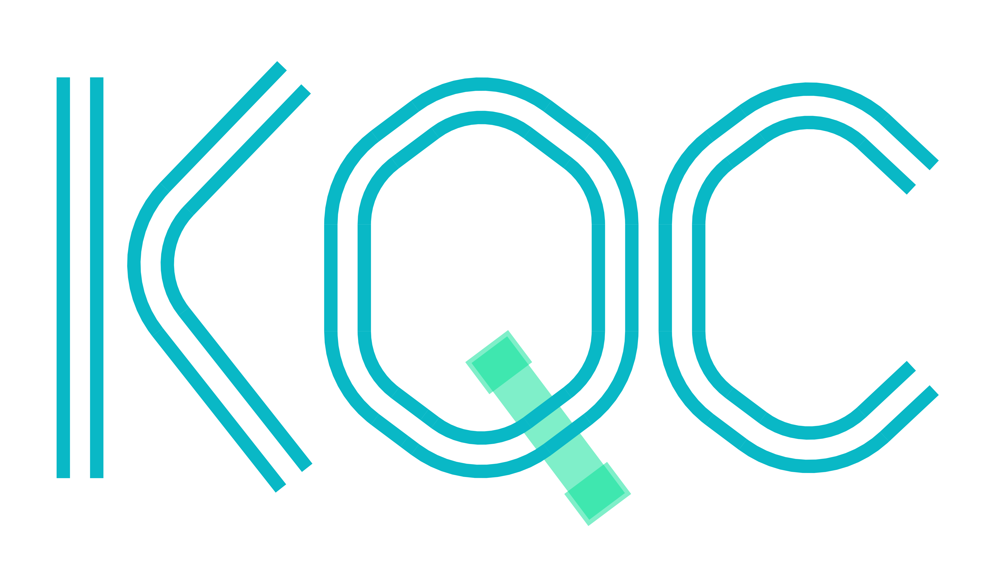

|LOGO|
======

.. image:: https://img.shields.io/badge/source-gitlab-ff69b4.svg
   :target: https://gitlab.iqm.fi/iqm/qe/KQCircuits

KQCircuits is a KLayout/Python-based superconducting quantum circuit library developed by IQM.

Documentation
-------------

.. toctree::
   :maxdepth: 2

   start/index
   user_guide/index
   libraries/index
   developer/index
   api/kqcircuits
   contributing
   trademarks

Indices and tables
==================

* :ref:`genindex`
* :ref:`modindex`
* :ref:`search`

