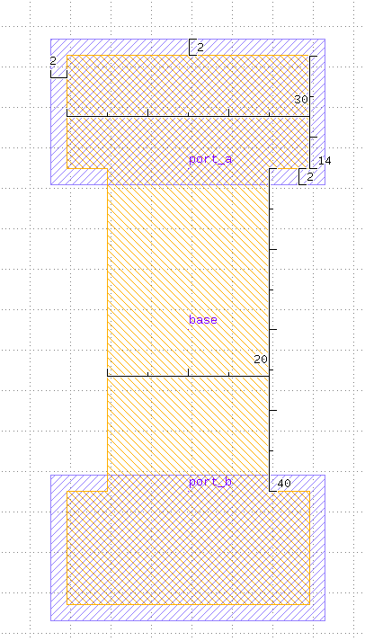
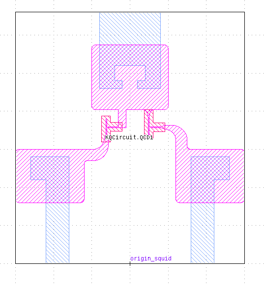
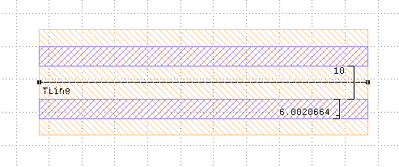

Elements
========

Airbridge
-------------------------

Origin is at the geometric center. The airbridge is in vertical direction.

Normal:
Bottom parts of pads in bottom layer, bridge and top parts of pads in top layer. Pads and bridge are rectangular.
Refpoints "port_a" and "port_b" at top pad points closest to origin.

Bow-tie:
Pads in bottom layer, bridge in top layer. The bridge is rectangular. The pads have a rectangular part and a
part which tapers in a 45 degree angle towards the center of the bridge. Refpoints "port_a" and "port_b" at tips of
pads.

.. kqc_elem_params:: kqcircuits.elements.airbridge.Airbridge.PARAMETERS_SCHEMA

**Origin:** Center

ChipFrame
----------

The chip frame consists of a dicing edge, and labels and markers in the corners.

.. kqc_elem_params:: kqcircuits.elements.chip_frame.ChipFrame.PARAMETERS_SCHEMA

Element
-------

Base class for all elements.

.. kqc_elem_params:: kqcircuits.elements.element.Element.PARAMETERS_SCHEMA

FingerCapacitorSquare
---------------------

Two ports with reference points. The arm leading to the finger has the
same width as fingers. The feedline has the same length as the width of
the ground gap around the coupler.

.. kqc_elem_params:: kqcircuits.elements.finger_capacitor_square.FingerCapacitorSquare.PARAMETERS_SCHEMA

**Origin:** Center

.. image:: ../images/elements/fingercaps.png
    :alt: fingercaps

FingerCapacitorTaper
--------------------

Two ports with reference points. Ground plane gap is automatically
adjusted to maintain the a/b ratio.

.. kqc_elem_params:: kqcircuits.elements.finger_capacitor_taper.FingerCapacitorTaper.PARAMETERS_SCHEMA

**Origin:** Center

.. image:: ../images/elements/fingercapt.png
    :alt: fingercapt

Launcher
--------

Launcher for connecting wirebonds. Default wirebond direction to west,
waveguide to east. Uses default ratio ``a`` and ``b`` for scaling the
gap. Taper length is from waveguide port to the rectangular part of
the launcher pad. Pad width is also used for the length of the launcher pad.

.. kqc_elem_params:: kqcircuits.elements.launcher.Launcher.PARAMETERS_SCHEMA

**Origin:** Waveguide port

.. image:: ../images/elements/launcher.png
    :alt: launcher

Marker
------

.. kqc_elem_params:: kqcircuits.elements.marker.Marker.PARAMETERS_SCHEMA

Meander
-------

Defined by two points, total length and number of meanders. Uses the
same bending radius as the underling waveguide. Each perpendicular
segment is a meander.

.. kqc_elem_params:: kqcircuits.elements.meander.Meander.PARAMETERS_SCHEMA

**Origin:** absolute position of ``start``

.. image:: ../images/elements/meander.png
    :alt: meander

SQUIDs
------

The SQUIDs are manually drawn and automatically loaded from a library
file. SQUIDs are referred to by the Cell name in the library file. Currently
there exist the following SQUID designs: "QCD1", "QCD2", "QCD3", "SIM1".

.. image:: ../images/squids/sim1.png
    :alt: sim1

Swissmon
---------

Swissmon type qubit. Each arm (West, North, East, South) has it's own
width. "Hole" for the island has the same ``gap_width`` for each arm.
SQUID is loaded from another library. Option of having fluxline.
Refpoints for 3 couplers, fluxline position and chargeline position.
Length between the ports is from waveguide port to the rectangular part of the launcher pad.
Length of the fingers is also used for the length of the launcher pad.

.. kqc_elem_params:: kqcircuits.elements.qubits.swissmon.Swissmon.PARAMETERS_SCHEMA

**Origin:** Center of the cross.

.. image:: ../images/elements/swissmon.png
    :alt: swissmon

WaveguideCoplanar
-----------------

Coplanar waveguide defined by the width of the center conductor and gap.
It can follow any segmented lines with predefined bending radius. It
actually consists of straight and curved PCells. Termination lengths are lengths of extra ground
gaps for opened transmission lines

**Warning** Arbitrary angle bents actually have very small gaps between
bends and straight segments due to precision of arithmetic. To be fixed
in a future release.

**Parameters:**

.. kqc_elem_params:: kqcircuits.elements.waveguide_coplanar.WaveguideCoplanar.PARAMETERS_SCHEMA

**Origin:** One port or follows the absolute coordinates of the path.

.. image:: ../images/elements/waveguide2.png
    :alt: waveguide2

WaveguideCoplanarCurved
-----------------------

.. kqc_elem_params:: kqcircuits.elements.waveguide_coplanar_curved.WaveguideCoplanarCurved.PARAMETERS_SCHEMA

WaveguideCoplanarStraight
-------------------------

.. kqc_elem_params:: kqcircuits.elements.waveguide_coplanar_straight.WaveguideCoplanarStraight.PARAMETERS_SCHEMA

WaveguideCoplanarTaper
----------------------

.. kqc_elem_params:: kqcircuits.elements.waveguide_coplanar_taper.WaveguideCoplanarTaper.PARAMETERS_SCHEMA

.. image:: ../images/elements/waveguide_taper.png
    :alt: waveguide_taper

WaveguideCoplanarTCross
-----------------------

.. kqc_elem_params:: kqcircuits.elements.waveguide_coplanar_tcross.WaveguideCoplanarTCross.PARAMETERS_SCHEMA