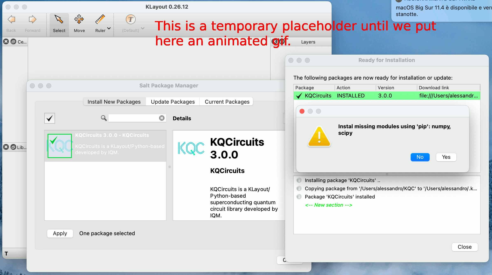

.. _salt_package:

Salt Package Guide
==================

A stable version of KQCircuits is often released as an easily accessible KLayout Salt Package.

Installing KQCircuits Salt Package
----------------------------------

Select "Tools -> Manage Packages" in the KLayout menu to install the KQCircuits package:

Note that KLayout was started in edit mode, see :ref:`usage`.

.. note::
   If KQCircuits is not working properly after installation (KQC libraries
   not visible, running any macro gives an error, etc.), there might be some
   problem with the specific KLayout version/build you are using, see
   :ref:`installation_issues` section for possible solutions.

User Specific Content
---------------------

KLayout Salt packages are read-only. The user may open the code (say, **[Package
KQCircuits]/kqcircuits/chips/simple**) with the embedded macro editor (**F5**) but it can not be
directly changed here. Of course, external code editors may be used to change these files or their
copies, but Salt package upgrades will override these changes.

Users may extend KQCircuits with their own Python packages using **KQCircuits -> Add User Package**
menu entry. Packages have a name and a directory linked to it. **Remove User Package** will undo the
linking without deleting the user created files. Package name should be a single lowercase word.
Remember to restart KLayout after adding or removing a user specific Python package.

PCell files should be added under the individual library directories using your favourite code
editor providing additional elements, chips etc. After adding or editing a file remember to use
**Reload libraries** menu entry so that it shows correctly in KLayout.

For example create a **user** package, this (by default) will be linked to a **user** directory in your
home folder. Copy KQC's ``finger_capacitor_square.py`` to ``user/elements/my_capacitor.py`` then edit
this file and change the ``FingerCapacitorSquare`` class name to ``MyCapacitor``. After restarting
KLayout the newly added ``MyCapacitor`` element will be available together with the standard
KQCircuits elements. Afterwards you may create a copy of ``simple.py`` chip, rename it and change the
capacitors using ``from user.elements.my_capacitor import MyCapacitor``. After reloading the libraries
your new chip will appear using your new capacitor.

Upgrading or Removing Salt Package
----------------------------------

After upgrading KQCircuits package KLayout needs to be restarted. See the release notes
for further details.

Downgrading or upgrading several steps at once is not guaranteed to always work. Upgrading KQC
usually works but the safest approach is to uninstall KQC and then install a new version.

For serious development work we suggest removing the Salt package and following the
:ref:`developer_setup`.

Release Notes
-------------

Here we list particular quirks of specific KQCircuits Salt packages. For a full list of changes see
the code repository.

* Version 4.5.0 is broken
* Version 4.1.0 requires full reinstall of KQC. Qubits directory has moved, to remove the earlier
  version we need to first remove KQC then install the new version.
* Version 4.0.0 requires full reinstall of KQC. Several files have been relocated, without a full
  reinstall multiple versions of the same file will be left behind.
* Version 3.3.0 needs manual install of ``tqdm`` Python module.
