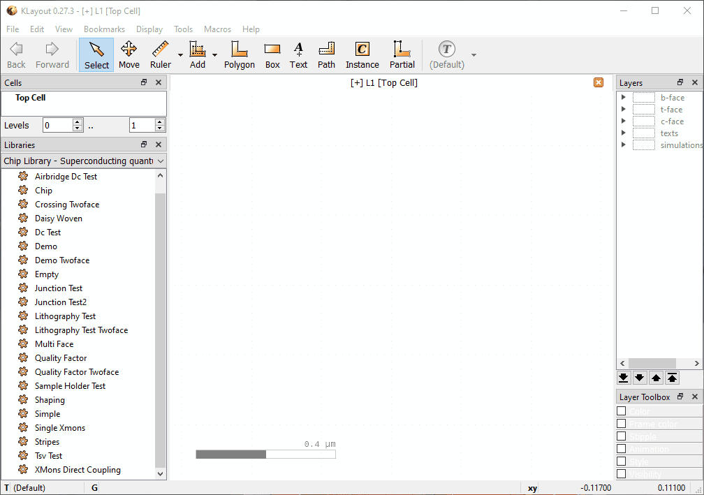

GUI Features
============

Useful hotkeys
--------------
- \* makes the full cell hierarchy visible. Otherwise only cell frames may be
  visible. Also accessible from "Display -> Full hierarchy" in the top menu.
- F2 centers the view on the top cell.
- Shift+F2 centers the view on the selected cell.

Placing Elements
----------------

KQC ``Elements`` are implemented as KLayout PCells. There are two ways to insert ``Elements`` into the layout:

#. dragging from **Libraries** toolbox

#. using "instance" tool from the toolbar

Either of these makes KLayout ask for a corresponding **PCell** instance from the **Library**.
If the corresponding **PCell instance** does not yet exist, corresponding code from the KQC library is evoked.

Here is an animation demonstrating dragging from the **Libraries** toolbox

.. image:: ../images/gui_workflows/placing_pcell.gif

Modifying Element parameters
----------------------------

If an ``Element`` is in the layout, one can change its **parameters** by double clicking the ``Element`` which should make
**Object properties** window appear. In the window there is a **PCell parameters** tab. Changes in the parameters
take effect when one clicks **Ok** or **Apply**.
At this event, corresponding **PCell** instance is created or reused from the **Library**.

.. image:: ../images/gui_workflows/modifying_pcell.gif

Due to the non-intuitive way KLayout is implemented there are a few common mistakes which prevent one from getting
**Object properties** window when double clicking the element.

* One is clicking on a ``Box`` instead of a ``PCell instance``. Some PCells have boxes around them and selecting a box has a higher importance than selecting an instance. One can see which is selected from the bottom edge of the screen. One can disable selecting boxes from "Edit -> Select" dropdown menu.
* The ``Element`` is no longer a PCell. If the PCell has been "turned static" it is no longer generated by code and parameters cannot be changed.
* The ``Element`` is inside another PCell. One can only change parameters of the top level Element. If one desires to change parameters of the sub-elements, the top level element should be turned static before.

.. _modifying_waveguides:

Modifying waveguides
--------------------

Some PCell parameters are geometric objects. For example, ``Coplanar Waveguide`` has a "guide path" parameter. In the
cell view window it is displayed as a black `Path` object. The geometric parameters can be changed using `Partial` tool
in the toolbar.

* Double clicking a path creates additional nodes.
* Dragging edges shifts the edge and adds orthogonal segments to keep the path connected.
* Dragging nodes shifts the nodes.

PCell shape is updated after each change in the parameters.

.. image:: ../images/gui_workflows/modifying_waveguide.gif

Converting elements placed in GUI into code
-------------------------------------------

KQCircuits includes a macro `export_cells_as_code.lym <https://github.com/iqm-finland/KQCircuits/blob/main/klayout_package/python/scripts/macros/export/export_cells_as_code.lym>`_ that can be used to
convert elements placed in GUI into code that can be used in chip PCells. For
more information, see the docstring and comments in the macro. The following
animation demonstrates how a chip is modified by placing elements in the GUI
and how to use this macro to include those elements in PCell generation code:

The macro has special handling for waveguides (of :class:`.WaveguideCoplanar` type).
The code generated for them automatically detects nearby reference points of
other elements, and uses these instead of hardcoded points as the positions
of the waveguide nodes. See the :ref:`modifying_waveguides` section above for
instructions on how to modify :class:`.WaveguideCoplanar` in GUI.

In order to make waveguides connect "nicely" to ports of other elements, most
ports in KQC elements have an additional "corner refpoint". To connect a
waveguide to port "a" of instance "x", you  should generally place its first
two points at ``x_port_a`` and ``x_port_a_corner``. The corner point is not
needed if the next point would anyway be in the direction of
``x_port_a_corner``, since the purpose of the corner point is only to make
the direction of the first waveguide segment aligned with the port.

Useful Menu Commands
--------------------

Several very useful macros are directly accessible from KLayout's "**Edit -> KQCircuits Library**"
drop-down menu:

- **Fill with ground plane grid** -- Creates a ground plane grid covering the top cell bounding box,
  except the parts in grid avoidance layer. Requires at least one cell to exist in the current
  layout. Only creates the grid for "b"-face.  Remember to unhide the b_ground_grid layer to make it
  visible.

- **All chips in the library** -- Opens a new layout and puts all available chips there arranged in
  a grid. Note that this operation may take several minutes.

- **Empty layout with a top cell and default layers** -- A new layout in KLayout is empty and has no
  assigned layers by default. This macro helps to create a more useful new layout with a predefined
  top-cell and the default KQCircuits layers.

- **Reload libraries** -- Reloads KQCircuits code from storage making it possible to modify elements
  and see the change without having to restart KLayout and reload the edited elements. This is
  illustrated in the end of previous section's video.
